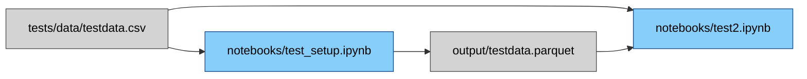

# 🧪 Data Analysis Starter Kit

This is a quick-start boilerplate for data analysis using:

- **[VS Code](https://code.visualstudio.com/)**
- **[uv](https://docs.astral.sh/uv/)** for package and environment management
- **Jupyter Notebooks** for exploration
- **[Data Wrangler](https://code.visualstudio.com/docs/datascience/data-wrangler)** for visual data transformation

Everything is configured to work with minimal setup.

---

## ✅ Prerequisites

### 1. Install VS Code

- Download and install from: [https://code.visualstudio.com/](https://code.visualstudio.com/)

### 2. Install the Data Wrangler extension

- Open VS Code.
- Go to Extensions (`Ctrl+Shift+X` or `Cmd+Shift+X`).
- Search for `Data Wrangler` and install it.

### 3. Install `uv`

Detailed instructions: [https://docs.astral.sh/uv/getting-started/installation/](https://docs.astral.sh/uv/getting-started/installation/)

#### On macOS / Linux

```sh
curl -LsSf https://astral.sh/uv/install.sh | sh
```

#### On Windows (PowerShell)

```powershell
powershell -ExecutionPolicy ByPass -c "irm https://astral.sh/uv/install.ps1 | iex"
```

---

## 🚀 Clone and Set Up the Project

### 1. Clone this repo

```sh
git clone https://github.com/ocewers/data-analysis-starter.git
cd data-analysis-starter
```

If you do not have GIT installed to be used in terminal you can also download the repo as a zip-file by pressing the "Code" button and selecting "Download ZIP" here on GitHub.

### 2. Sync the environment and install dependencies

```sh
uv sync
```

This will:

- Create a local `.venv`
- Install all dependencies from `pyproject.toml`

---

## 🧭 Open in VS Code

1. Open the folder in VS Code:

```sh
code .
```

2. VS Code should auto-detect the `.venv` and activate it.
3. Open the test notebook: `tests/notebooks/test_setup.ipynb`
4. Run cells to confirm the environment is working.
5. Try right-clicking a `DataFrame` output and select **Open in Data Wrangler**.

### Tests

This project includes unit tests to ensure the functionality of the data processing pipeline. Tests are located in the `tests/` directory and are organized by functionality and can be run using the following command:

```sh
uv run pytest
```

### 📁 Project Paths and Configuration

This project uses a `config.py` file in the root directory to define key paths using Python's `pathlib`, ensuring compatibility across Windows, macOS, and Linux.

All paths are dynamically resolved, so you can run scripts or notebooks from any directory without adjusting file paths.

In a notebook, start by running the bootstrap script so Python can locate the `config` module:

```python
# Initialize paths for the config module
%run ../../bootstrap.py

from config import TESTS_DIR, OUTPUT_DIR
```

For standalone scripts, add the project root to `sys.path`. Set `ROOT_LEVELS_UP` depending on how deeply the script is nested:

```python
import sys
from pathlib import Path

ROOT_LEVELS_UP = 1
sys.path.append(str(Path(__file__).resolve().parents[ROOT_LEVELS_UP]))
import config
```

---

#### 📌 Usage Examples

##### 1. Read a CSV file from the `data/` directory

```python
import pandas as pd
from config import DATA_DIR

# Example: ./data/input.csv
csv_path = DATA_DIR / "input.csv"
df = pd.read_csv(csv_path)

print(df.head())
```

##### 2. Read a CSV file from a subdirectory inside data/

```python
import pandas as pd
from config import DATA_DIR

# Example: ./data/raw/2025-07-data.csv
csv_path = DATA_DIR / "raw" / "2025-07-data.csv"
df = pd.read_csv(csv_path)

print(df.info())
```

---

### 📈 Pipeline Graph Export

Generate a Mermaid diagram of notebook ↔ data dependencies:

```sh
python utils/pipeline_graph.py --out output/pipeline.mmd
```

The script scans `notebooks/` for common read/write patterns and emits a Mermaid `graph LR` diagram. Use VS Code's Mermaid preview or any renderer to visualize the resulting graph.

Example output:


---

## 📁 Project Structure

```text
.
├── .github/               # GitHub configuration files (e.g. workflows)
├── .vscode/               # VS Code settings for environment
├── data/                  # Source data (raw, external, or versioned) content ignored by git
├── notebooks/             # Jupyter notebooks for exploration, analysis, dev, or documentation
├── output/                # Generated output and results from code: charts, reports, exports, transformed data
├── src/                   # Source code for data processing, analysis, and utilities
├── tests/                 # Contains test files and test notebooks with some test data
│   ├── data/              # Test data files
│   └── notebooks/         # Test notebooks
├── utils/                 # Utility scripts and functions
├── .gitignore             # Includes .venv, data/, __pycache__, etc.
├── .python-version        # Optional version pinning (e.g. for pyenv)
├── bootstrap.py           # Script for setting up the project environment from notebooks
├── config.py              # Configuration for paths and directories
├── pyproject.toml         # Project dependencies and metadata
└── README.md
```

---

## 🛠 Tips & Troubleshooting

### Interpreter not selected?

- Open Command Palette (`Ctrl+Shift+P` / `Cmd+Shift+P`)
- Type: `Python: Select Interpreter`
- Choose the one pointing to `.venv`

### Jupyter not working?

- Make sure you opened the repo **after** running `uv sync`
- Check the Python extension is installed

### Data Wrangler not appearing?

- Make sure the extension is installed.
- Try restarting VS Code if it doesn't show on right-click.

---

You're now ready to explore and analyze data!! 🎉
